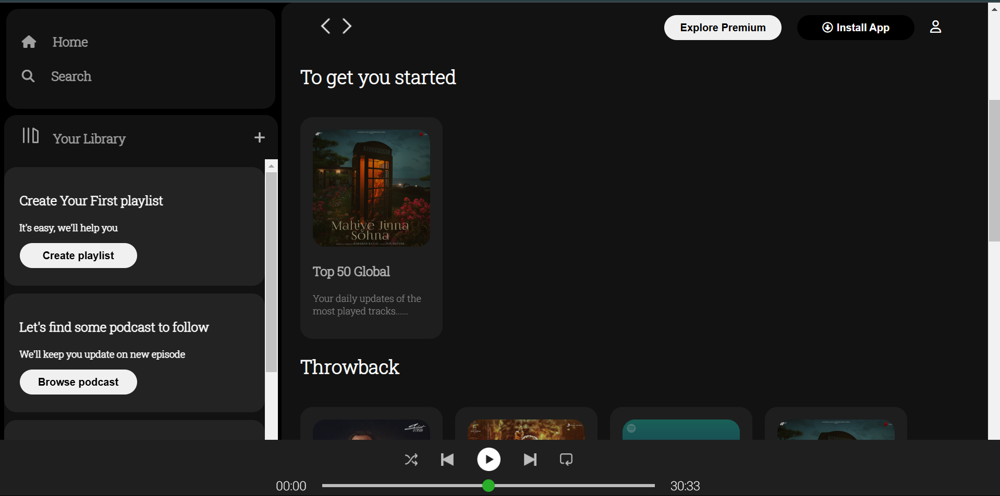

# Spotify landing page
This is a static html landing page of spotify. This was just a part of my html and css practice.
It's built on HTML and vanilla CSS. No more functionality has been added to it.
If you wish you can go through it by cloning into your local machine. However, If you want to add any functionality or want to use anything in your personal project, you can do so!

## Installation

- Clone it into your local machine
  ```bash
  git clone  https://github.com/MdMahdiHasanTazelly/spotify_landing_page

- Navigate to project directory & start server
    ```bash
    cd spotify_landing_page
    npm start

Now, open a tab in your browser and past the generated URL from the terminal. And Here we go!

## Screenshots
 ### Home page
 
